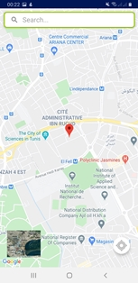

# DevCARE

DevCARE is a Mobile Application developed to facilitate missions of Commercial Development Pole of clubs. This app will help clubs and associations in prospecting the companies by saving their informations in a server, and you can add, edit or delete data as welle as importing new excel or csv files to extract data from them also you can click on any company to display informations and redirect to google map to see the localization of the company. In addition, you can send emails from the app using templates saved in the data base. And there is other fonctionnalities.

✅ Keywords: Android Studio, Java, XML, SQLite, Scrum

Demo: https://drive.google.com/file/d/1pAeHjHv1Kde67jmK0jGFvv681QC_dmM0/view

Team Members:

               

               

               

